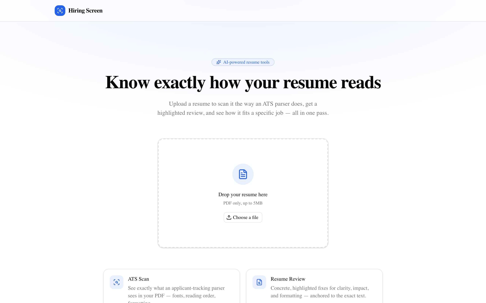
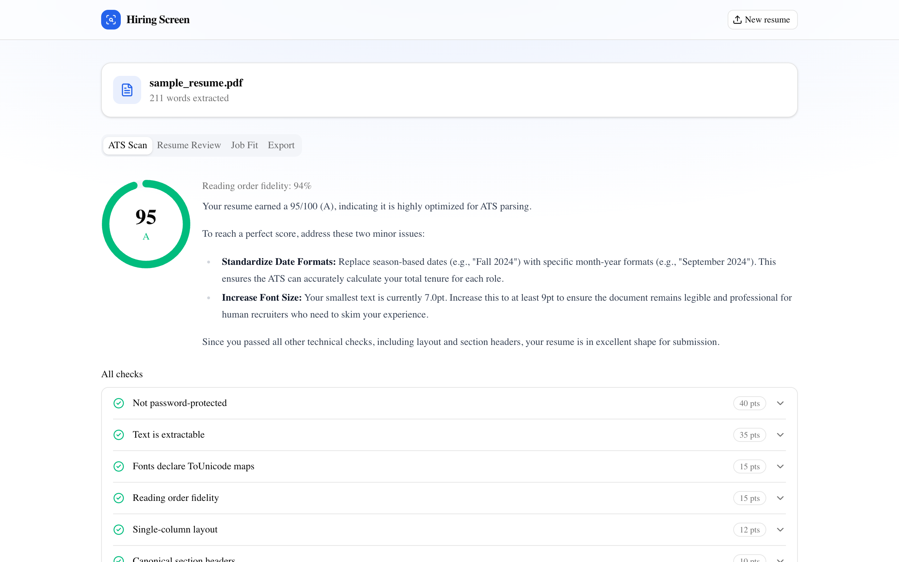
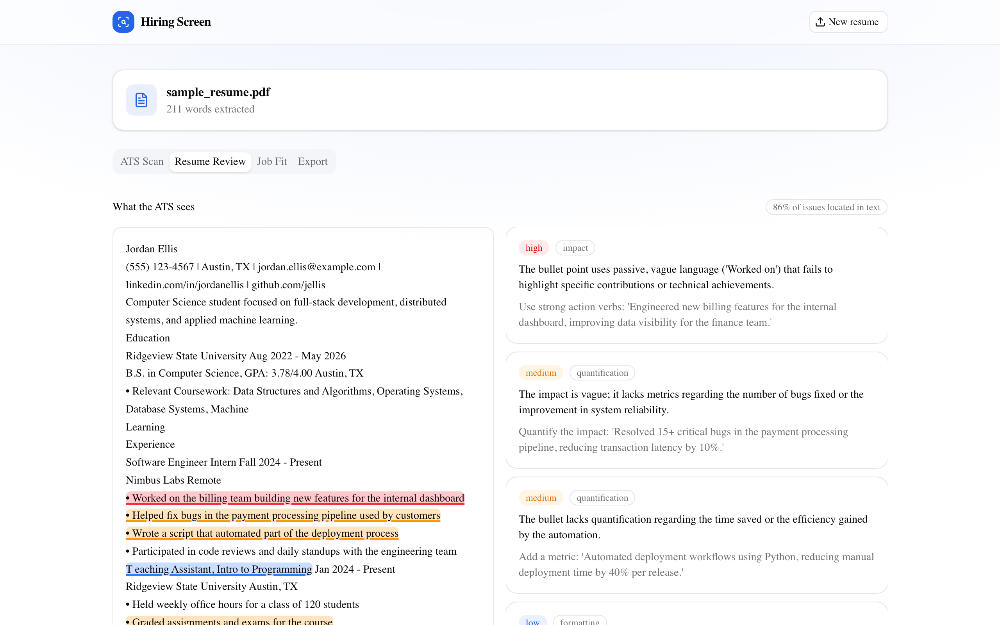
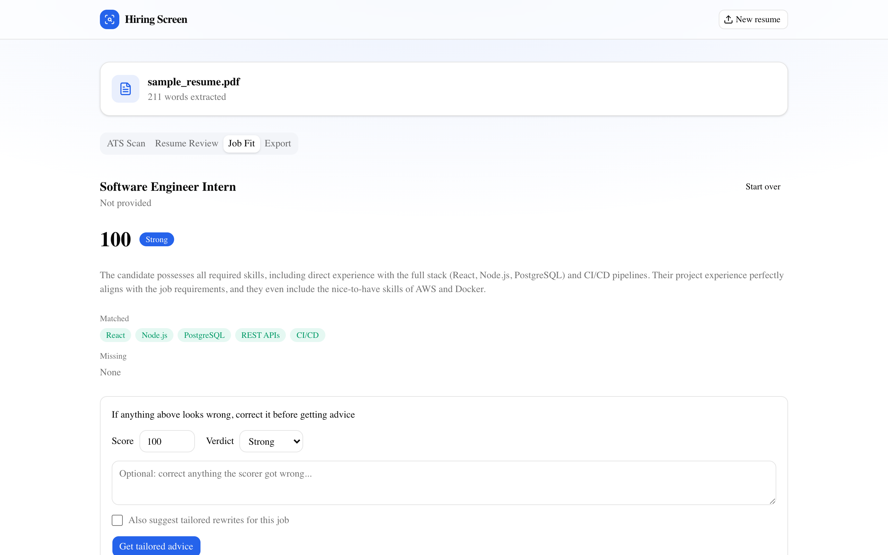
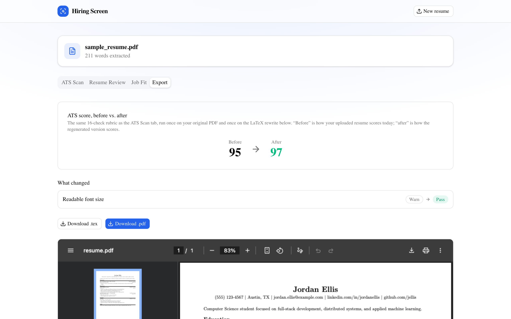

# Hiring Screen

Upload a resume and it tells you exactly what an ATS parser sees in the PDF, gives you a
highlighted line-by-line review, scores your fit against a job description with a human-in-the-loop
correction step, and rewrites the whole thing as a clean LaTeX resume — verified by round-tripping
the generated PDF back through the same ATS scanner.

Started as a LangGraph learning project (a single job-fit pipeline); the core multi-agent graph is
still there, now joined by three more graphs and a Next.js + FastAPI web app in front of them.

> Upload a PDF → a deterministic PDF-structure analyzer (font `/ToUnicode` maps, reading-order
> fidelity, column geometry) shows what an ATS parser sees → LLM agents explain what to fix → the
> LaTeX rewrite is verified by re-scanning the PDF it just produced. **ATS score 95 → 97**, same
> rubric, both ends.

## Screenshots



**ATS Scan** — deterministic score, plain-English narrative, and the full 16-check breakdown



**Resume Review** — issues anchored to exact, highlighted text



**Job Fit** — score against a pasted job description, editable before advice is generated



**Export** — LaTeX rewrite with the before/after ATS diff that motivated this whole project



## Features

1. **ATS scan** — 16 deterministic checks modeled on what real parsing engines
   (Textkernel/Sovren, Daxtra, Affinda — the engines behind Workday/Greenhouse/iCIMS) actually do:
   text extraction, reading-order reconstruction, section segmentation, field extraction, keyword
   coverage. Same PDF in, same score out, every time — no LLM in the scoring loop.
2. **Resume review** — an LLM finds concrete issues (clarity, impact, formatting, grammar,
   quantification) and anchors each one to an exact, verbatim quote in the extracted text, which
   the UI highlights inline as "what the ATS sees."
3. **Job fit** — scores your resume against a pasted job description (matched / adjacent /
   missing skills), pauses for you to correct the score before committing to a verdict, then
   routes to interview prep, a gap-closing plan, or better-fit role suggestions — plus optional
   tailored rewrite suggestions for that specific job.
4. **LaTeX rewrite** — restructures your resume into a clean, ATS-safe LaTeX template and compiles
   it to PDF with [Tectonic](https://tectonic-typesetting.github.io/), then re-scans the result with
   the same ATS checker to show the before/after.

## Architecture

```
web/     Next.js (App Router) + Tailwind + shadcn/ui — the primary interface
api/     FastAPI — thin routes over the same agents/graphs the CLI uses
graphs/  four purpose-built LangGraph graphs (below)
agents/  LangChain agents, one concern each, shared by every graph and the CLI
ats/     deterministic PDF-forensics scanner — zero LLM calls
latex/   Jinja2 → LaTeX renderer + Tectonic compile wrapper
tools/   Pydantic schemas + the quote-to-span anchoring used by review & tailoring
```

The backend never imports anything from `web/`, and `main.py` / `graph.py` / LangGraph Studio still
work exactly as before — the web app is a new front end on the same agents, not a replacement.

### Four graphs, not one

A single mega-graph with a mode switch was considered and rejected: it would union every flow's
state fields, sprout `if mode ==` guards in every node, and read as indecision. Instead:

| Graph | Shape | Registered as |
|---|---|---|
| `hiring_screen` | the original pipeline — validate → analyze → score → **dynamic `interrupt()`** → route by verdict | `graph.py:graph` |
| `job_match` | same idea, rebuilt for HTTP: validate → analyze → score → **`interrupt_after`** (static) → route by verdict | `graph.py:job_match_graph` |
| `resume_audit` | `parse_resume` fans out into `scan_ats` (deterministic) and `review_resume` (1 LLM call) running independently, then `merge` — a genuine parallel graph, not a linear script | `graph.py:resume_audit_graph` |
| `latex_export` | `structure_resume` → `render_latex` → `compile_pdf` → `verify_ats` | `graph.py:latex_export_graph` |

All four show up in LangGraph Studio (`langgraph dev`) as separate graphs.

### Human-in-the-loop, two ways

The original CLI pipeline (`agents/supervisor.py`) uses LangGraph's dynamic `interrupt()` — it
resumes by threading a typed-in string back as the paused node's return value, which is natural for
a blocking `input()` prompt. `job_match` (the one the web app calls) instead compiles with
`interrupt_after=["score_fit"]` and resumes via `graph.aupdate_state(...)` +
`graph.ainvoke(None, ...)`, because the real requirement over HTTP isn't a text prompt — it's the
UI editing the actual `FitScore` object (score, verdict) before advice is generated. Nice
side effect: the web graph doesn't need a `human_review` node at all — the pause is a compile
option, and the expensive advice call only fires once you ask for it.

### The ATS rubric

`ats/report.py` scores deterministically: `score = 100 − Σ(weight for each failed check) −
0.5·Σ(weight for each warning)`, graded A–F. No LLM in this loop — the score is a pure function of
the PDF's structure, every time.

| Check | Weight | What it catches |
|---|---:|---|
| Not password-protected | 40 | Encrypted PDFs many ATS reject outright |
| Text is extractable | 35 | Scanned/flattened-image resumes — the ATS sees nothing |
| Fonts declare `/ToUnicode` maps | 15 | Subset-embedded fonts missing a CMap extract as garbage (the #1 real cause of mojibake) |
| Reading-order fidelity | 15 | How well a geometric top-to-bottom pass agrees with linear extraction |
| Single-column layout | 12 | Multi-column layouts many ATS parsers read row-by-row across, scrambling both columns |
| Canonical section headers | 10 | "My Journey" instead of "Experience" fails synonym-list segmentation |
| Contact info is parseable | 10 | Email/phone regex over the extracted text |
| No table-based layout | 8 | Tables (especially a skills grid) are often read out of order or skipped |
| No private-use-area glyphs | 8 | A Word bullet or icon-font glyph extracting as `` |
| Parseable date ranges | 6 | Season dates, shorthand years, missing formats confuse tenure calculation |
| No unresolved ligatures | 5 | "efficient" extracting with a fi ligature glyph instead of "f"+"i" |
| Links are visible as text | 5 | A clickable link with no visible URL text is invisible to plain-text extraction |
| Readable font size | 4 | Recruiter-readability, not an ATS concern |
| Reasonable content length | 4 | Too sparse to rank on keywords, or too long |
| Safe generating tool | 3 | `/Producer` fingerprint — Canva/Figma/Illustrator are risky, pdfTeX/Word are safe |
| Reasonable page count | 3 | >2 pages for an early-career resume |

Two libraries do genuinely different jobs here: **pypdf** for the object layer (fonts, encryption,
`/ToUnicode`, annotations, metadata), **pdfplumber** for the geometry layer (word bounding boxes for
reading-order and column detection, per-char font size, table detection) — pypdf can't do geometry
and pdfplumber doesn't expose font-dict internals. Neither can read text baked into a raster image
or vector outlines; that's reported as a *possible* scanned-image finding, never claimed as certain.

### Quote anchoring

The review and tailoring agents return issues with a verbatim `quote` and a `line` number (not
character offsets — LLMs are unreliable at those). `tools/text_anchor.py` resolves each quote to a
span: exact match in a `line ± 2` window first (which is what disambiguates a quote that appears
more than once), then anywhere in the document, then a fuzzy fallback (stdlib `difflib`) within the
window for a near-verbatim quote. Unresolved issues are kept (not dropped) with a null span; the
API reports an `anchor_rate` so the UI — and this README — can be honest about it. In practice this
has hit 100% in every real run so far.

## The LaTeX round-trip

`agents/resume_structurer.py` turns the resume into a structured Pydantic object (never raw text);
a Jinja2 template with custom `((` `))` delimiters (so `{` `}` stay free for LaTeX) renders it to
`.tex`; three filters (`latex/filters.py`) escape it — `tex()` is the actual security boundary
between resume content and the compiler, unit-tested against LaTeX command injection. Two fixes
that came directly out of testing this round-trip on a real resume, both worth knowing about if you
touch this code:

- **Ligatures.** LaTeX's own font ligature substitution turns "fi"/"fl"/"ff" into a single glyph at
  typeset time, which can extract as a different codepoint than the original letters — the fix
  (`microtype`'s `\DisableLigatures`) only works under pdfTeX, but Tectonic uses XeTeX. The
  `tex()` filter instead inserts an empty TeX group (`f{}i`) between ligature-forming letters,
  which breaks adjacency in any engine.
- **False-positive column detection.** A resume that right-aligns dates with `\hfill` — a totally
  standard pattern — creates a wide empty band in a page-wide word histogram, which looks just like
  a column gutter. The fix requires that gutter to hold across most *rows*, not just in aggregate:
  a real two-column layout has both sides populated on nearly every row; `\hfill` dates only affect
  the handful of rows that have one.

## Setup

```bash
python -m venv venv && source venv/bin/activate
pip install -r requirements.txt          # add -r requirements-dev.txt for tests
cp .env.example .env                     # fill in GOOGLE_API_KEY
brew install tectonic                    # optional — LaTeX export degrades gracefully without it
```

For the web app:

```bash
cd web && npm install
cp .env.local.example .env.local
```

## Usage

**Web app (primary):**

```bash
uvicorn api.main:app --reload          # backend on :8000
cd web && npm run dev                  # frontend on :3000
```

Upload a resume, then use the four tabs. Set `MOCK_LLM=1` before starting the API to exercise the
whole frontend against canned responses (`api/fixtures/`) at zero API cost.

**CLI:**

```bash
python main.py
```

Prompts for a resume path, then a job description (paste it to your clipboard, press Enter).

**LangGraph Studio:**

```bash
langgraph dev
```

Lists all four graphs. For `hiring_screen` specifically, the chat is a two-step conversation: paste
the job description, then send either the resume's file path or its pasted text (Studio's file
attachment button doesn't deliver to a custom-state graph like this one).

## Testing

```bash
pytest
```

Covers the three modules where subtle bugs actually hide: `ats/checks.py` (deterministic scoring
logic), `tools/text_anchor.py` (quote resolution — ligatures, dashes, whitespace, duplicates,
unresolvable quotes), and `latex/filters.py` (the TeX-escaping security boundary). No live LLM calls
in the suite — it runs offline. Everything LLM-facing was instead verified live against a real
resume during development; see git history for specifics.

## Security notes

- Uploads are validated by magic bytes (`%PDF-`) and capped at 5MB; PDF parsing runs with a 15s
  timeout and rejects documents over 10 pages before doing real work (PDF bombs, deeply nested
  object graphs).
- Tectonic always runs with `--untrusted` (disables `\write18`/shell-escape); the `.tex` source is
  written to a temp file and only its path is ever passed as an argv element.
- Resume text is never logged. LangSmith tracing, if enabled, would capture full resume contents —
  it defaults off (`LANGSMITH_TRACING` unset).
- **This is a local dev tool, not a public deployment.** There's no auth and no rate limiting; every
  endpoint spends real API quota and CPU on whoever calls it. Don't put this behind a public URL
  without adding both.

## Project layout

```
agents/
  supervisor.py       # original pipeline: builds the StateGraph, defines state and routing
  job_analyzer.py      fit_scorer.py       interview_prep.py
  gap_analyzer.py       role_advisor.py     ats_advisor.py
  resume_reviewer.py    resume_tailor.py    resume_structurer.py
middleware/
  guardrails.py       # input validation
tools/
  scoring.py          # JobAnalysis / FitScore
  ats_models.py       # AtsCheck / AtsReport / KeywordCoverage
  review_models.py    # ReviewIssue / ReviewReport / Segment
  resume_models.py    # StructuredResume, for the LaTeX pipeline
  text_anchor.py       file_tools.py        search.py
ats/
  extract.py          # pypdf + pdfplumber forensics -> ExtractedPdf, canonicalize()
  checks.py           # 16 pure ExtractedPdf -> AtsCheck functions
  report.py           # scoring + keyword coverage
latex/
  filters.py          # tex / texurl / texinline
  render.py            compile.py           templates/resume_classic.tex.j2
graphs/
  job_match.py          resume_audit.py      latex_export.py
api/
  main.py             # FastAPI app
  config.py             deps.py (incl. MOCK_LLM)   store.py   review_helpers.py
  routes/
    resume.py            ats.py               review.py
    job_match.py          latex.py
  fixtures/            # canned MOCK_LLM responses
web/
  src/app/                                 # landing page, /analyze tabs shell
  src/components/{ats,review,fit,export}/  # one folder per tab
  src/lib/{api,types,analysis-context}     # typed fetch wrappers, context+reducer
tests/                # ats checks, text anchoring, latex filters
main.py               # CLI entry point
graph.py               langgraph.json      # exports/registers all four graphs
visualize.py
```

## Stack

- **LangGraph** — `StateGraph`, `create_react_agent`, both `interrupt()` and `interrupt_after` for
  human-in-the-loop
- **Gemini** (`gemini-3.1-flash-lite`) via `init_chat_model` — free tier, so LLM calls are kept to
  one per feature wherever possible (the ATS scan and resume review need 0–1 total, not one per
  check)
- **FastAPI** + **Next.js** (App Router) + **Tailwind** + **shadcn/ui**
- **pypdf** + **pdfplumber** for PDF forensics, **Tectonic** for LaTeX compilation
- **Pydantic** for structured LLM output end to end, backend to frontend
